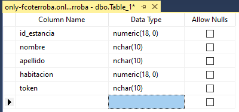

# 10/11/2020
## HDFS/MapReduce
En este [enlace](https://docs.microsoft.com/en-us/azure/hdinsight/hadoop/apache-hadoop-run-samples-linux) aparecen varios ejemplos.
## Hive
Hive está desarrollada por Facebook y permite transmitir información en una consulta.

Viene con un ejemplo de sample table y las consultas se realizan en un lenguaje de consultar **similar** a SQL


Cuando sacamos datos, disponemos de la opción de **Tez UI** que es, a fin de cuentas, cómo funciona Hive por detrás.

Podemos trabajar con Hive en Power BI e incluso tiene su [propio driver de ODBC](https://www.microsoft.com/en-us/download/details.aspx?id=40886).
### Table Storage
En Azure existe también los [**table storage**](https://azure.microsoft.com/es-es/services/storage/tables/) en la que, a diferencia de Hive, puedes lanzar **consultas SQL**. 

Además, incluye librerías para desarrollar apps en .NET, Python, C++, PHP, Ruby, Java, etcétera.

Se crea una storage automáticamente cuando creamos un clúster.

Para añadir datos al storage usamos el explorador de storage y agregamos nuevos datos.


La alternativa, si no, es el [Explorador de Azure Storage](https://azure.microsoft.com/es-es/features/storage-explorer/)
# 11/11/2020
## Distribuciones Hadoop
Una distribución de Hadoop es, a fin de cuentas, un conjunto de herramientas basadas en Apache Hadoop.

Sigue la filosofía de las distribuciones Linux.


### Hortonworks
Hortonworks nace en el 2011 con una aportación capital de Yahoo! y es patrocinador de Apache Software Foundation.

En 2018 fue comprada por Cloudera aunque esta empresa sigue manteniendo dicha distribución.

Es la distribución usada por Azure e IBM.

Su producto estrella es **HDP** (Hortonworks Data Platform) de software libre y que incluye el famoso programa de administración Ambari.
### MapR
MapR nace en 2009 con fondos de Google o Lightspeed.

Tiene su propio motor de HDFS llamado **MapR Filesystem**. 

Mientras que Cloudera y Hortonworks basan su protección en herramientas de encriptación, **MapR** lo basa en su sistema de ficheros propios.

MapR ofrece **mejor rendimiento** que Cloudera o Hortonworks

#### Ventajas
  - Está desarrollado en C pero es compatible a nivel de API con HDFS, desarrollado en Java. (guardando las distancias)
  - Soporta accesos aleatorios de escritura
  - Puede ser visualizado externamente como unidad NFS
  - Se pueden hacer snapshots.

MapR es la distribución usada por Google Cloud Platform para ofrecer servicios de Hadoop.

Fue finalmente comprado por HP en 2019.

---

Hadoop divide ficheros en trozos de **64MB** y los reparte por todo el cluster HDFS.

Vamos a fijarnos en el CSV de [crímenes de Chicago desde el 2001](https://catalog.data.gov/dataset/crimes-2001-to-present-398a4). 

La relación jerárquica entre Hive y Hadoop es la siguiente:


# 12/11/2020
## HBase

HBase se monta de manera similar a Hadoop en Azure.

Para acceder a HBase existe una shell para lanzar comandos. Para ello tenemos que usar `hbase shell`

Podemos comprobar el estado del servidor usando `status`

Hacemos un ejemplo para probar los conocimientos y creamos dos tablas. El comando para crear tablas es `create 'nombre de la tabla'`

Con `list` podemos ver un listado de las tablas y con `exists 'nombre de la tabla'` podemos comprobar si una tabla existe o no.


Podemos borrar la tabla con `drop 'nombre de la tabla'`

Podemos insertar datos usando el comando `put 'nombre de la tabla, 'índice donde acceder', 'nombre de la columna: nombre', 'Valor'` | **Ejemplo**: `put 'prueba', '1', 'personal_data: name', 'Fran'`t

### NoSQL

NoSQL puede seguir o no el modelo relacional, seguir o no el paradigma ACID y tener o no estructuras como tablas.

NoSQL se almacena en información con forma de árbol. Clave-Valor

Un JSON o XML por ejemplo, sería una base de datos NoSQL.

Las bases de datos NoSQL no diferencian por el tipo de valor que se almacena.

Algunos ejemplos de bases de datos NoSQL son:
  - MongoDB
  - Redis
  - CouchDB
  - Voldemort
  - Cassandra
  - HBase
  - FireBase
  - ...
 
 ## Cosmos DB
 
Es una base de datos NoSQL distribuida por todas las zonas de los datacenters de Microsoft.

Para crearlo en Azure hemos usado un núcleo de SQL y tarda un cuarto de hora en implementarse, más o menos.

El container es la equivalencia a la tabla.

Para empezar vamos a explorador de datos, creamos una nueva base de datos y posteriormente un container, configurando correctamente las opciones.

Para añadir información tenemos que hacerlo en modo JSON.


Las consultas en CosmoDB son muy similares a SQL, simplemente usamos c para definirnos a una tabla y **SIEMPRE** nos vamos a definir a ella así.


## Spark

Spark nace en 2009.

Vamos a levantar un HDInsight sobre Spark.

Para usar la terminal de Spark usaremos el comando `spark-shell`
# 17/11/2020
## Azure Functions
Hoy vamos a realizar funciones en Azure usando el SDK de .NET y el lenguaje de programación **C#**.

El ejercicio y ejemplos realizados se pueden consultar [pinchando aquí](https://github.com/fcoterroba/Apuntes_AndaluciaLAB/tree/main/Big_Data/Azure_Functions)

Si quiero pasar un JSON a C#, existe una librería llamada `newtonsoft.json`

Hay dos formas de crear JSON. La primera de ellas es generar una clase y luego crear un objeto serializado de JSON. **Ejemplo**:
```cs
public class datos {
  public string name {get; set;}
  public string surname {get; set;}
}
...
datos misdatos = new datos();
misdatos.name = name;
misdatos.surname = surname;
string json = JsonConvert.SerializeObject(misdatos);
```
La otra manera es algo más sencilla y rápida. En la misma línea se puede crear y luego serializar en JSON.
```cs
var misotrosdatos = new {name= "Jose", surname = "Jimenez"};
string json2 = JsonConvert.SerializeObject(misotrosdatos);
```
### Ejemplo Twitter
Un tweet, por detrás es un JSON que contiene fecha, contenido, número de retweets, de likes, etcétera.

El primer paso para empezar a usar funciones de Twitter, es registrarse en el [Twitter Developer](https://developer.twitter.com/en)

A continuación, vamos a descargar el proyecto sampleado de Twitter Client Core, disponible en el [repositorio de Azure en GitHub](https://github.com/Azure/azure-stream-analytics/tree/master/DataGenerators/TwitterClientCore) y empezaremos a programar en base al programa, escrito en C#
# 18/11/2020
## Twitter Client Core
Vamos a trabajar con la carpeta de [TwitterClientCore](https://github.com/fcoterroba/Apuntes_AndaluciaLAB/tree/main/Big_Data/TwitterClientCore)
# 19/11/2020
## APIs
En esta sesión vamos a utilizar las Azure Functions como APIs y crear una funcionalidad completa.
Vamos a generar el API de la aplicación móvil de un hotel para la gestión del desayuno, consumo de productos, reserva de servicios, etcétera.
Lo que vamos a acabar haciendo es:
  - Crear una base de datos SQL Server
  - Crear un contenedor de funciones
  - Reservas de servicios

Vamos a crear una instancia accesible desde el exterior poniendo un punto de conexión público en el método de conectividad y permitiendo las dos opciones de las reglas del firewall.
Nos vamos a conectar posteriormente usando SQL Server Management Studio
Es necesario habilitar la encriptación (que por defecto está habilitada)
Una instancia SQL no puede ser upgradeada a una SQL managed
### Pasos
  1. Crear una tabla con los campos necesarios


  
  2. Crear una función `getToken` que pasa la habitación y el apellido y devuelve un código alfanumérico aleatorio 
  3. Haz una API para que un huesped pueda reservar una hora en el desayuno (pasa el token como parametro para saber que es él)
  4. fjdaskdjfakfsd